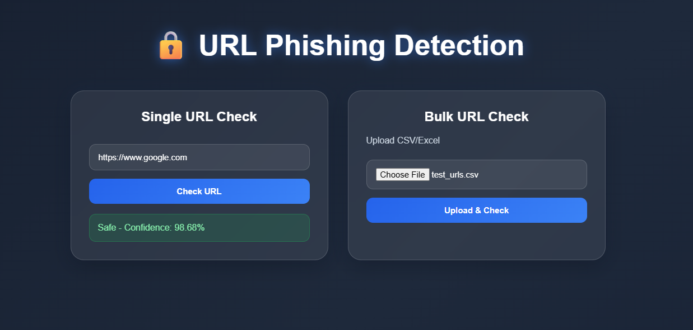
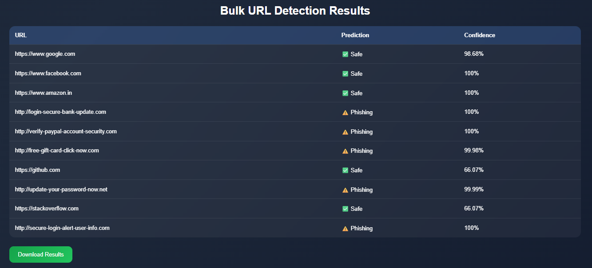

# url-phishing-detection
Built a machine learning-based phishing URL detection system with real-time and bulk URL analysis features.
Developed a React and Flask web application with confidence scoring and downloadable reports.

## 🚀 Features

- 🔍 Single URL Phishing Detection
- 📂 Bulk URL Analysis (CSV/Excel Upload)
- 📊 Confidence Score Prediction
- ⬇️ Download Bulk Analysis Results
- 🎨 Modern React UI with Animations
- ⚡ Flask REST API Backend
- 🤖 Machine Learning-based Classification

---

## 🛠️ Tech Stack

- React.js
- Flask
- Python
- Scikit-learn
- TF-IDF Vectorization
- Pandas

---

## 📸 Screenshots

### Home Page

### Bulk Detection Results

